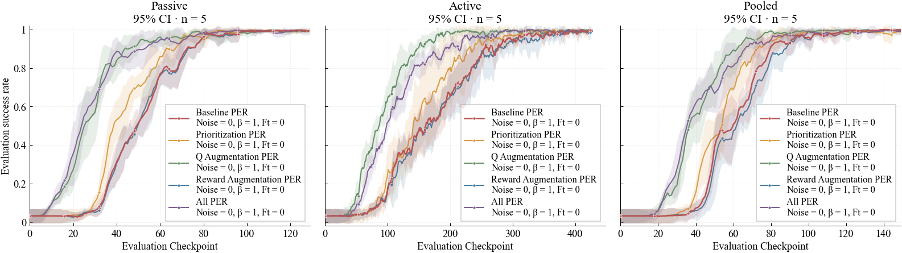
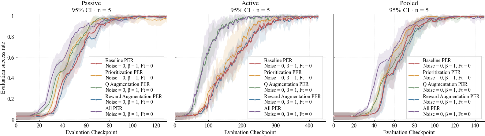
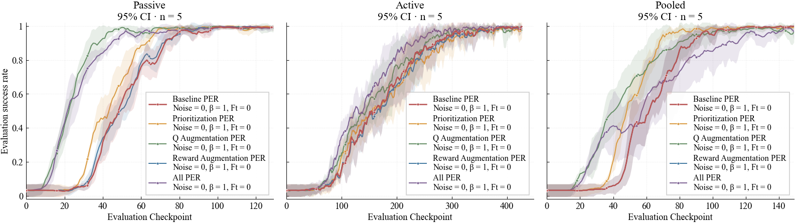
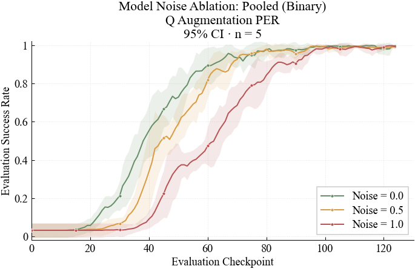
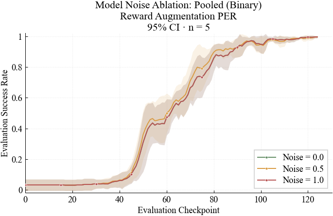
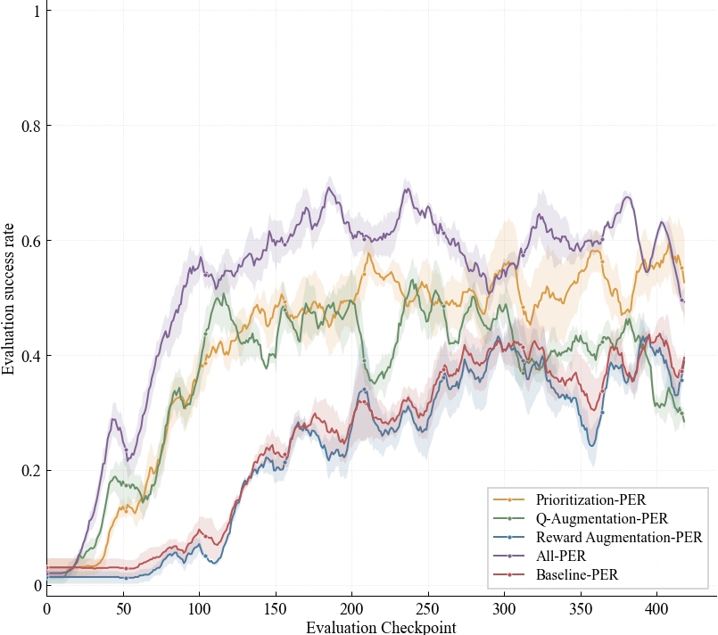

# OfflineNeuroloop

Offline RL with neural (fNIRS) feedback integrated into training via **finetune**, **interleave**, and related loops. Experiments sweep neural conditions, model noise, β, and finetune threshold across **Passive**, **Active**, and **Pooled** tasks, with reward/action granularities **binary**, **ternary**, and **continuous**.

## Setup

```bash
conda env create -f environment.yml
conda activate offline-neuroloop
```

HPC job arrays and manifest sweeps: see [`docs/HPC.md`](docs/HPC.md).

## Results

Publication-style curves (mean ± 95% CI, `n = 5`) in [`src/results/figures/`](src/results/figures/). Plots are generated from `src/results/graphs_finetune.ipynb`.

### Best settings per condition

Best (noise, β, ft) curve for each neural condition, shown for Passive / Active / Pooled. Active uses a longer checkpoint window than Passive and Pooled.

**Binary**



**Ternary**



**Continuous**



### Model noise ablation (binary, Pooled)

Noise levels `{0.0, 0.5, 1.0}` at fixed β / ft for selected conditions.

**Q-Augmentation PER**



**Reward Augmentation PER**



**Dense Reward Function - Quick Test**
*New results, not discussed in paper.*
A quick experiment to analyze the neural signal's effect on robot learning with a dense reward function. 
(SEM Error Bars, 4 trials, Passive Binary experiment)



## Repo layout

| Path | Role |
|------|------|
| `configs/` | Domain and sweep YAMLs |
| `manifests/` | Trial manifests for HPC arrays |
| `src/` | Envs, agents, neural loaders, training loops |
| `src/results/` | Aggregated CSVs, notebooks, figures |
| `submit_hpc.sh` / `run_trial.py` | Cluster submit and single-trial entrypoints |
